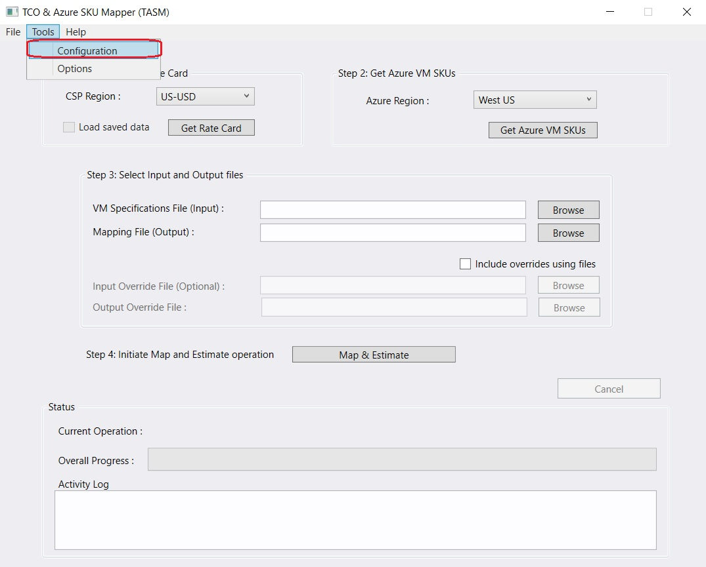
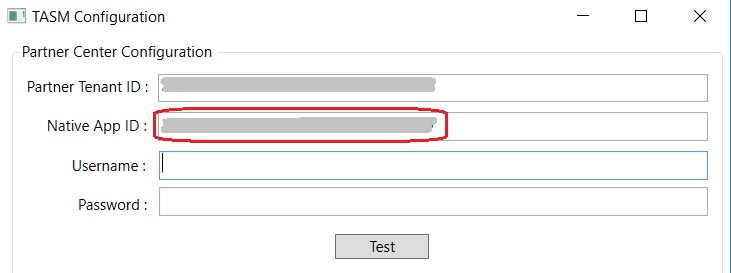
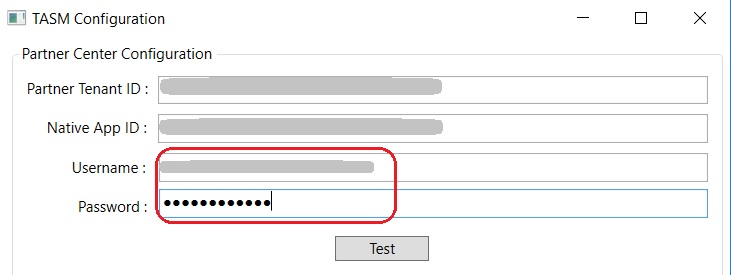
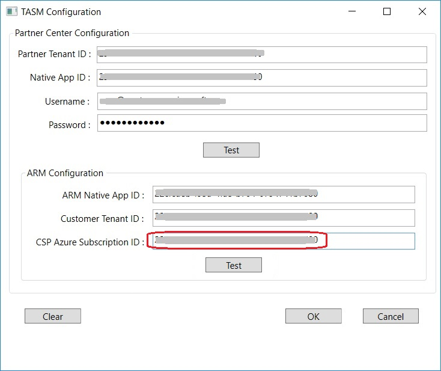


# Introduction
This document is step by step guide for the configuration process. The configuration is required before you can use the tool. 

# Prerequisites
* The steps in this document requires the user to have Global Admin permissions in the CSP Partner’s Azure Active directory.
* A customer and one or more CSP Azure subscriptions have already been created in Partner Center. The Azure subscription will be used to run the ARM API to fetch the Azure VM SKU list.

# Configuration Steps

1. Open the tool. TASM.exe is the name of the application file that needs to be run.

2. From the **Tools** menu, click on **Configuration**. 
    
    

3. Open a browser and sign in to the [Partner Center][1].

4. From the **Dashboard** menu, select **Account settings**, then **App Management**.

5. On the **Account settings** page, under the **Native App section**, click on **Add new native app**. The details of the app created, will be used in the subsequent steps. This step can be skipped if you intend to use a native app that may have been created earlier and appears under the Native App section on this page. 
    
    

6. Copy the value for **Account ID** and enter that value for **Partner Tenant ID** in the TASM Configuration window. 
    
    

7. Copy the value for **App ID** and enter that value for **Native App ID** in the TASM Configuration window. 
    
    

8. In TASM Configuration window, provide the **Username** and **Password**. The user must have the Admin Agent role assigned in Partner Center. You can follow the [Steps for creating a user with Admin Agent role assigned][3]. 
    
    

9. Click on **Test** to validate the details provided. 
    
    

10. Create a Native app for ARM API access with preconsent configured. To do so, follow the [Step by Step Guide for App setup by CSP Partner for ARM API access][2].

11. Copy the value of the preconsent configured native app created in the previous step and enter that value for **ARM Native App ID** in the TASM Configuration window. 
    
    

12. Switch back to the Partner Center window. On the Dashboard page, Click **View Customers**. 
    
    

13. Click on the dropdown adjacent to a customer that you intend to use in this configuration. 
    
    

14. Copy the value for **Microsoft ID** and enter that value for **Customer Tenant ID** in the TASM Configuration window. 
    
    

15. Click on **View Subscriptions**. On the subscriptions page, click on the dropdown adjacent to an Azure subscription that you intend to use in this configuration. The status of the subscription must be **Active**. 
    
    

16. Copy the value for **Subscription ID** and enter that value for **CSP Azure Subscription ID** in the TASM Configuration window. 
    
    

17. Click on **Test** to validate the details provided. 
    
    

18.  Click on **OK** to save the configuration. 

Back to [ReadMe][4]

[1]: https://partnercenter.microsoft.com
[2]: CSP-ARM-API-Setup.md
[3]: CreateAdminAgentUser.md
[4]: ../README.md

