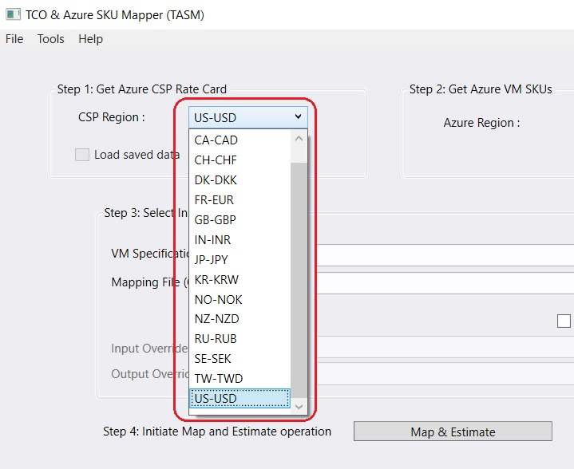
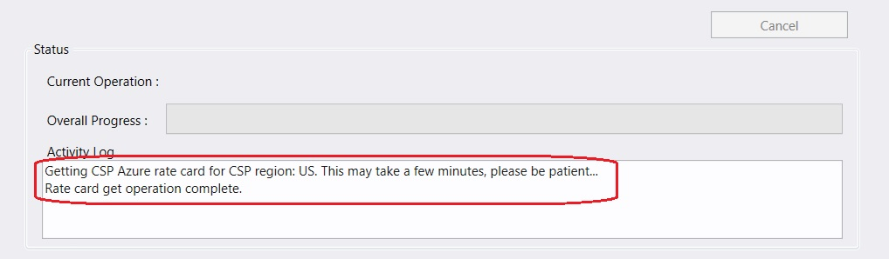
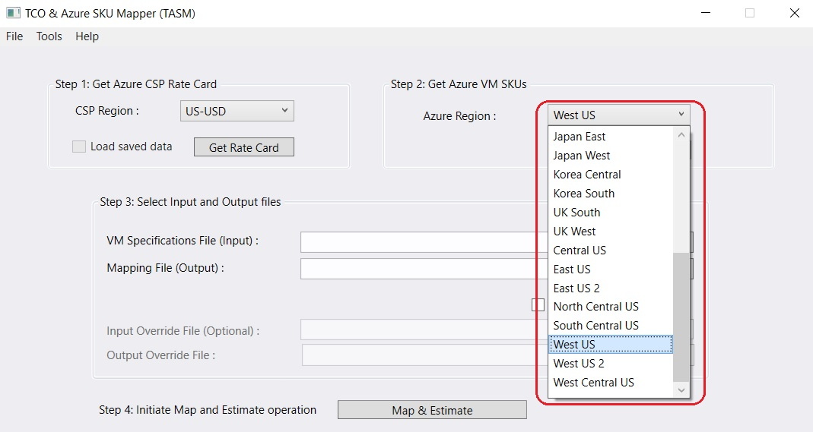
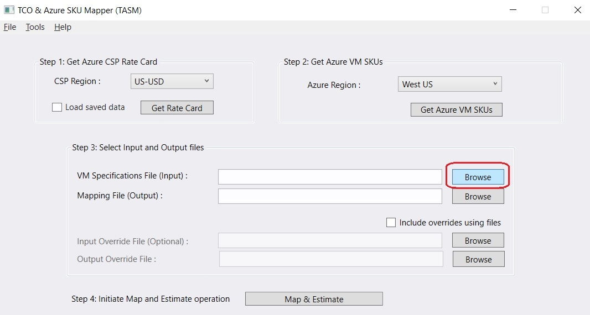
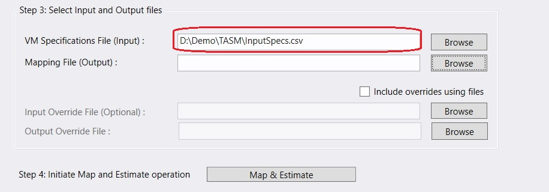
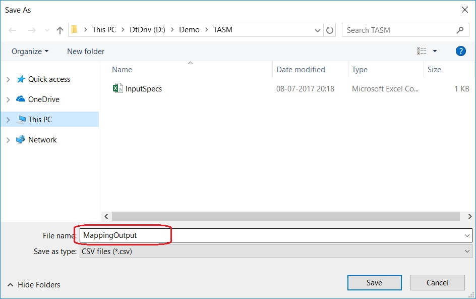

#  1. Introduction
This document provides information on how to use the tool. Please note that the tool has to be configured before it can be used. 

#  2. Running the tool

TASM enables CSP Partners to rapidly estimate the costs for hosting VMs in Azure through the automated mapping of virtual machine specifications to equivalent Azure VMs. The virtual machine specifications are to be provided using an input file in a CSV format.
A sample input file can be generated by the tool as shown in the steps below.

1. Open the tool. TASM.exe is the name of the application file that needs to be run.

2. From the **File** menu, click on **Generate VM Specifications File Sample**. Provide the name of the file to be generated. This step will generate a sample input file in a CSV format. 
    
    

3. Modify the file by adding rows for the instances (Virtual machines - on-premises or competing cloud platform or a physical server) that need to be mapped and estimated. Refer to the [document][1] that explains the columns in the input file. Save the file in CSV file format only. Do not leave the file open in the program that you are using to edit the file as this will not allow the tool to open the file.

    

4. On the TASM tool, in the section **Step 1: Get Azure CSP Rate Card**, select the region in **CSP Region**. 

    

5. Click on **Get Rate Card**. Wait for the operation to complete, this can take a few minutes. You can view the status of operation in **Activity Log**.
    
    
    
    

6. In the section **Step 2: Get Azure VM SKUs**, select the region in **Azure Region**.
    
    

7. Click on **Get Azure VM SKUs**. Wait for the operation to complete. You can view the status of operation in **Activity Log**.

    

8. In the section **Step 3: Select Input and Output files**, Click on **Browse** for the **VM Specifications File (Input)** and select the input file saved in earlier steps of this document.
    
    
    
    

9. Click on **Browse** for the **Mapping File (Output)** and provide the filename to be created. This will a new file that will be created and will contain the ouput on a successful run of the subsequent steps in the tool.
    
    
    
    
    
10. Click on **Map & Estimate** to initiate the operation. Wait for the operation to complete. You can view the status of operation in **Activity Log**. You can view the progress in the **Overall Progress**.
    
    

    

11. On successful run, the output file be generated. Open the file from Windows explorer to view the output. Refer to the [document][2] that explains the columns in the output file.
    
    

Back to [ReadMe][3]

[1]: VMSpecificationsInputFile.md
[2]: MappingOutputFile.md
[3]: ../README.md